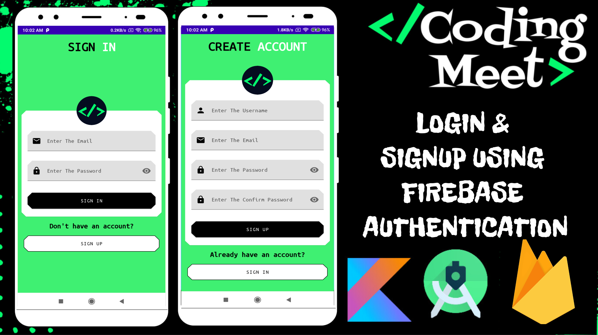
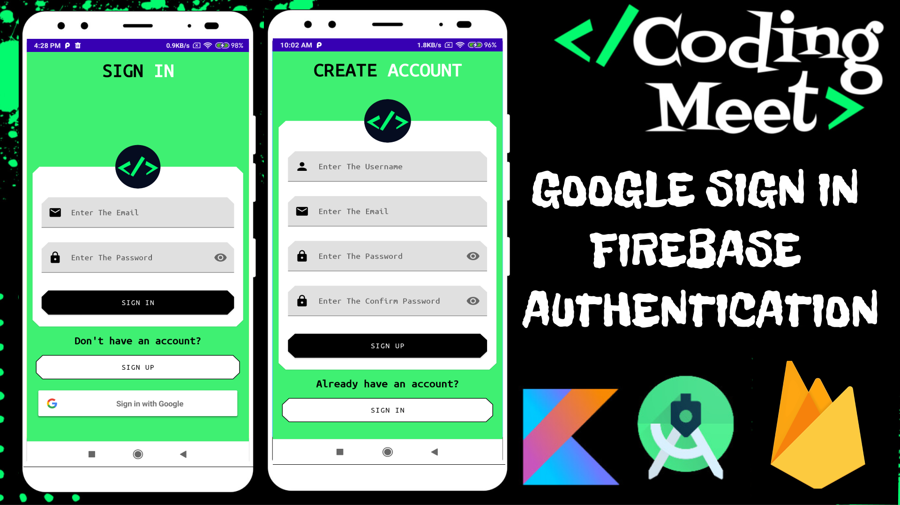
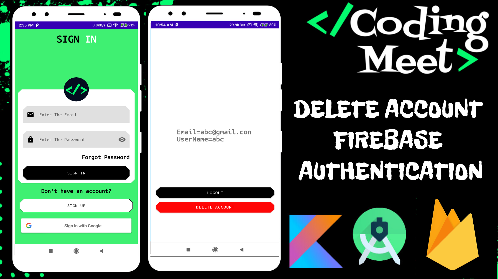
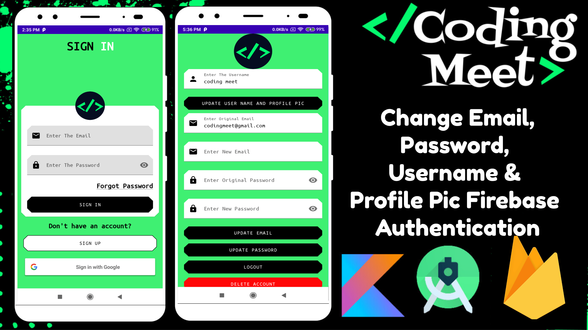

# Firebase-Authentication-App
Firebase Authentication in Android Studio Kotlin

# [YouTube Video Link](https://youtube.com/playlist?list=PLlSuJy9SfzvFNtX4C8FPLzfMcokmF1kV_)

## Support the Project

If you find this tutorial series helpful and would like to support the development of more content, consider buying me a coffee! Your support helps in creating high-quality tutorials.

Your generosity is greatly appreciated! Thank you for supporting this project.
